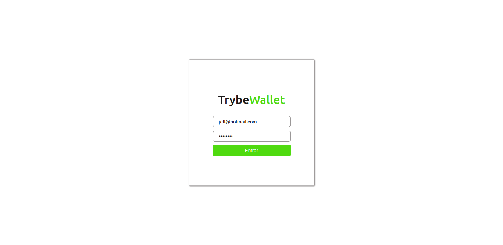
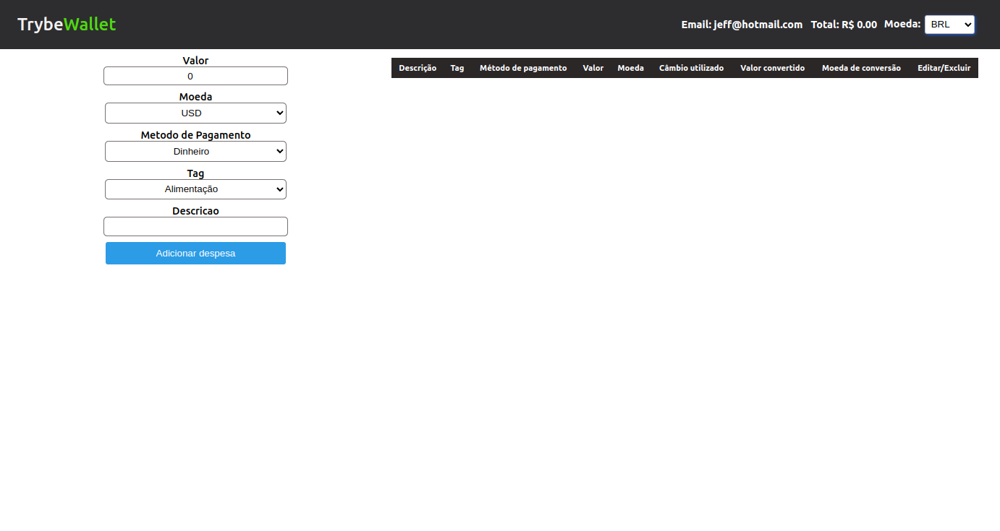
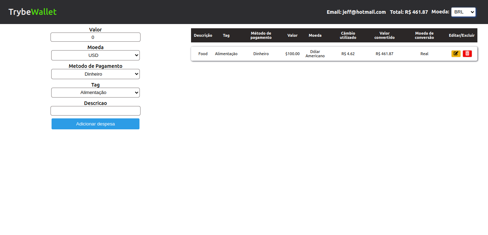
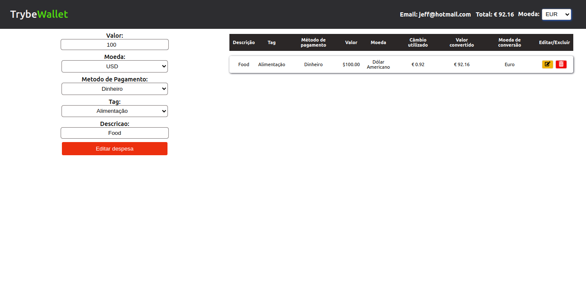

# Trybe Wallet 

The idea with this project is to create an expense portfolio, where the user can login, add an expense, edit it, delete it.

The user can choose between several currencies to create an expense and change / view the value of the expense in any currency chosen.

# Technologies Used

For this project the following technologies were used:

- [JavaScript](https://developer.mozilla.org/pt-BR/docs/Web/JavaScript)
- [ReactJS](https://pt-br.reactjs.org/)
- [Redux](https://redux.js.org/)
- [Docker](https://www.docker.com/)

 

## Login

 

## Home

 

## Home with expense

 

## Home with another base currency

 

## Edit mode

 

# How to Use:

1. Clone the repository

  ~~~bash
  git clone git@github.com:JeffThierch/Tryunfo.git
  ~~~

2. In the root of the project change the .env_example file to .env

3. (Optional) - Change the environment variables.

4. In the root of project run the commands:

  ~~~bash
  docker-compose up --build
  ~~~

5. If everything is configured correctly, after the build process you can simply access the application.
